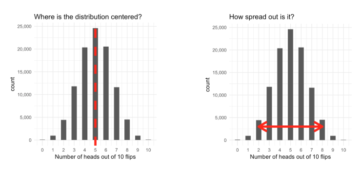

# R probability in the Batcave
Probability is the glue between descriptive statistics and inferential statistics. Probability is the study of how data can be generated from a model.

In this notebook we'll discuss the following:
1. Binomial distribution
2. Laws of probability
3. Bayseian statistics
4. Related distributions

## 1. Binomial distribution
```{r}
library(ggplot2)

rbinom(1,1,.5)
#number of random draws, number of random coins we're flipping, prob of heads

#flip 1 fair coin 1 million times
flips<-rbinom(1000000,1,.5)
table(flips)
hist(flips)
# OBSERVATION: The higher the number of flips the more likely we tend to 0.5

#flip 1 biased coin 1 million times
flipsbias<-rbinom(1000000,1,.8)
table(flipsbias)
# OBSERVATION: The higher the number of flips the more likely we tend to p

#flip 1 million fair coins once
flipmil <- rbinom(1,1000000,0.5)
flipmil
# OBSERVATION: The higher the number of flips the more likely we tend to p

#flip 1 million fair coin 1 million times
flipmilmil <- rbinom(1000000,1000000,0.5)
mean(flipmilmil)
min(flipmilmil)
max(flipmilmil)
plot(flipmilmil)
# OBSERVATION: The higher the number of flips the more likely we tend to p

# Generate 100 occurrences of flipping 10 coins, each with 30% probability
test <- rbinom(100,10,0.3)
hist(test)
```
### Density and cumulative density
X ~ Binomial(10,.5)
Pr(X=5)
#### Running simulations
```{r}
#Probability that we'll get exactly x heads with 10 flips
flip10 <- rbinom(100000,10,.5)
hist(flip10)
#x=5
mean(flip10==5)
#x=1
mean(flip10==1)

#Probability that we'll get exactly 1 head with 1 flip
flip1 <- rbinom(100000,1,.5)
hist(flip1)
mean(flip1==1)

```

#### Calculating the exact density with pmf and cdf

```{r}
dbinom(5,10,0.5)
#pmf
pbinom(4,10,0.5)
#cdf
```

#### Expected value and variance


X~Binomial(n,p)
E[x]=np
Var[x]= np(1-p)
```{r}
flip10 <-rbinom(1000000,10,0.5)
mean(flip10)
var(flip10)
```

### Theoretical underpinnings

- **Random Experiment** - A random experiment has an outcome that cannot be predicted

- **Sample Space** - The set of all possible outcomes of a random experiment is called the sample space.
  - Toss a coin once *S = {H,T}*
  - Toss a coin twice *S = {HH, HT, TH, TT} *

- **Outcomes** - Results of an observation

- **Event** - Any subset of the sample space that we are looking for.


## 2. Laws of probability
## 3. Bayseian statistics
## 4. Related distributions
